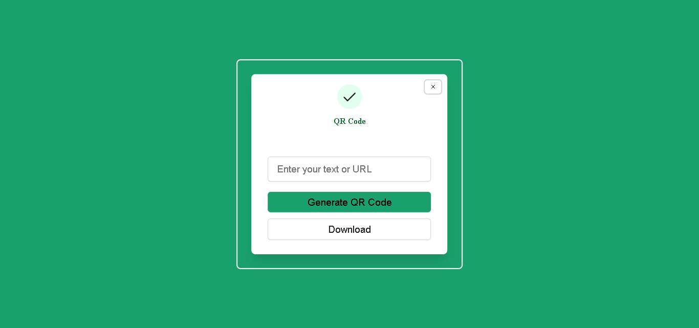

# QR Code Generator

## Overview

This is a simple QR code generator project using HTML, CSS, and JavaScript. The application allows users to input text or a URL and generates a QR code for the provided input.

## Table of Contents

- [Features](#features)
- [Demo](#demo)
- [Installation](#installation)
- [Usage](#usage)
- [Contributing](#contributing)
- [License](#license)

## Features

- Input text or URL and generate a QR code.
- Responsive design for various screen sizes.
- Easily customizable styles.

## Demo

[Link to live demo](https://qr-code-generator-app-url.netlify.app/)



## Installation

To run the QR code generator locally, follow these steps:

1. Clone the repository:

    ```bash
    git clone https://github.com/ayeshasikander/QR-Code-Generator.git
    ```

2. Open the project folder:

    ```bash
    cd qr-code-generator
    ```

3. Open the `index.html` file in your preferred web browser.

## Usage

1. Open the application in your web browser.
2. Enter the text or URL for which you want to generate a QR code.
3. Click the "Generate QR Code" button.
4. The QR code will be displayed on the screen.
5. You can right-click on the generated QR code to save or share it.


## License

This project is licensed under the MIT License - see the [LICENSE](LICENSE) file for details.
